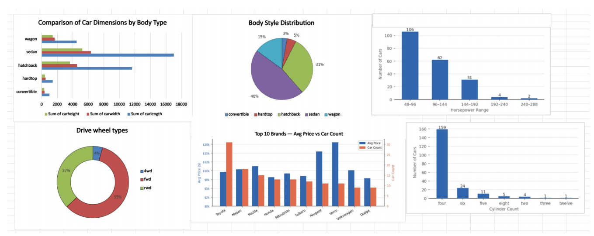

# 🚗 Car Price Analytics

## 📊 Dashboard Preview



---

## 📖 Project Overview

This project analyzes a dataset of **205 vehicles across 22 automobile brands** using Microsoft Excel. The objective was to explore pricing trends, vehicle characteristics, and brand performance through interactive dashboards and visual analytics.

The dashboard provides insights into body styles, drivetrain types, horsepower distribution, engine cylinder counts, vehicle dimensions, and brand-wise pricing patterns.

---

## 🎯 Project Objectives

- Analyze vehicle pricing trends across different brands.
- Understand the distribution of vehicle body styles.
- Compare vehicle dimensions by body type.
- Explore drivetrain and engine characteristics.
- Identify factors that influence vehicle prices.
- Present findings through an interactive dashboard.

---

## 🛠️ Tools & Technologies Used

- Microsoft Excel
- Pivot Tables
- Pivot Charts
- Data Cleaning
- Data Analysis
- Data Visualization

---

## 📈 Dashboard Components

### 1. Body Style Distribution
Analyzes the proportion of sedans, hatchbacks, wagons, hardtops, and convertibles within the dataset.

### 2. Vehicle Dimensions by Body Type
Compares average length, width, and height across different body styles.

### 3. Drive Wheel Types
Visualizes the distribution of FWD, RWD, and 4WD vehicles.

### 4. Horsepower Distribution
Shows the frequency of vehicles across different horsepower ranges.

### 5. Engine Cylinder Count
Examines the distribution of engine cylinder configurations.

### 6. Top 10 Brands Analysis
Compares average vehicle price and vehicle count across leading automobile brands.

---

## 🔍 Key Findings

- Sedans and hatchbacks account for the majority of vehicles in the dataset.
- Front-wheel-drive (FWD) vehicles dominate the market.
- Most vehicles are powered by 4-cylinder engines.
- Premium vehicles represent a smaller market segment but command higher prices.
- Vehicle price is strongly influenced by body style, drivetrain type, and engine configuration.
- Toyota leads in volume, while premium brands achieve higher average prices.

---

## 💡 Business Insights

- Economy vehicles dominate the market and drive overall sales volume.
- Sedans remain the most strategically important vehicle segment.
- High-performance vehicles are niche products with premium pricing.
- Drivetrain type and cylinder count are strong indicators of market positioning.
- Brands with lower sales volume often achieve higher average prices.

---

## 📂 Repository Structure

```text
Car-Price-Analytics/
│
├── Dataset/
│   └── CarPrice_Assignment.xlsx
│
├── Image/
│   └── dashboard.png
│
├── Report/
│   └── Car Price Analytics.pdf
│
└── README.md
```

---

## 📁 Dataset Information

- Total Records: 205 Vehicles
- Total Attributes: 26
- Brands Covered: 22

---

## 🚀 Future Improvements

- Build an interactive Power BI version of the dashboard.
- Add KPI cards and dynamic slicers.
- Perform predictive analysis on vehicle prices.
- Develop machine learning models for price forecasting.

---

## 👨‍💻 Author

**Satyajit Pradhan**

Aspiring Data Analyst | Excel | Power BI | Data Visualization

GitHub: https://github.com/Satyajit7822

---

⭐ If you found this project useful, consider giving it a star!
